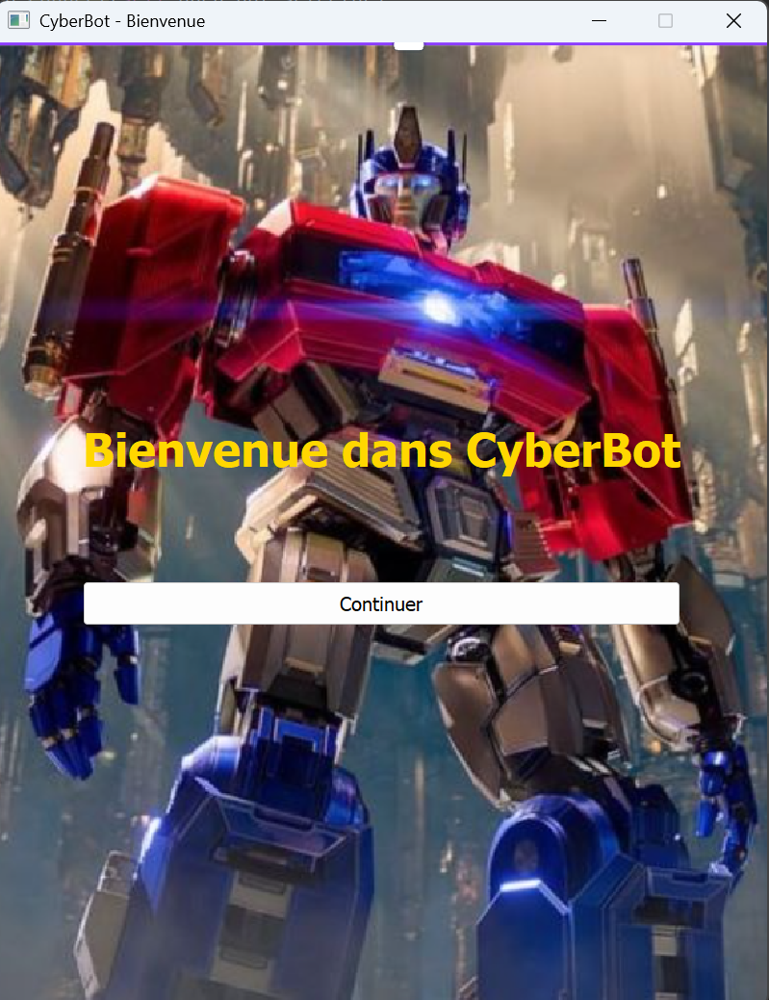
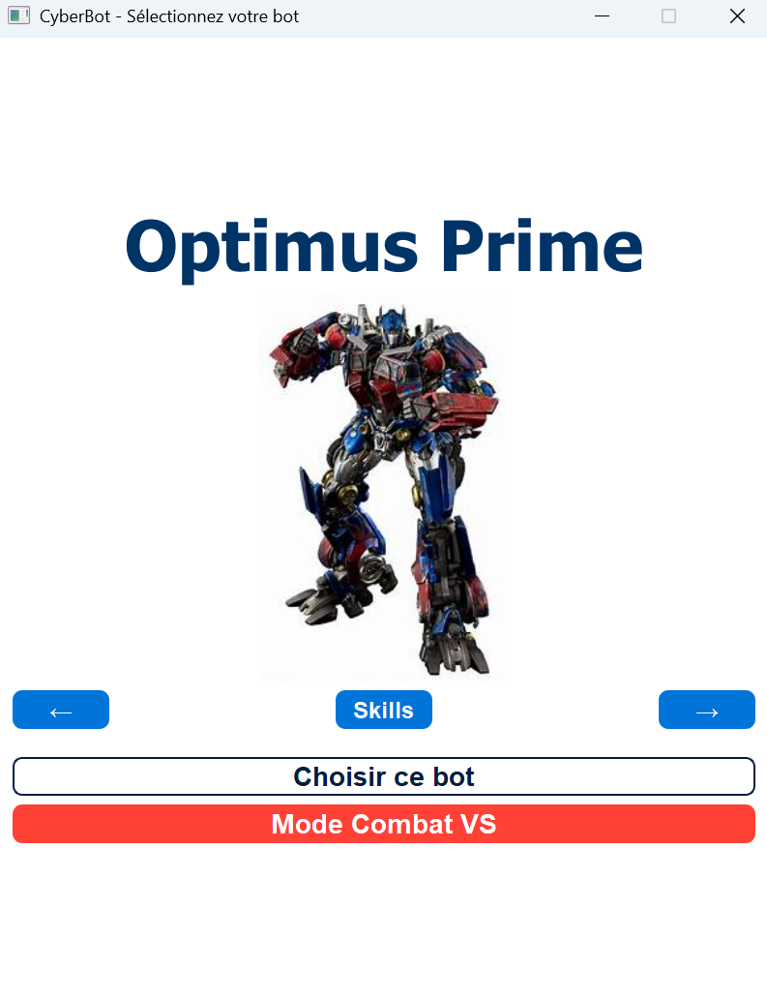
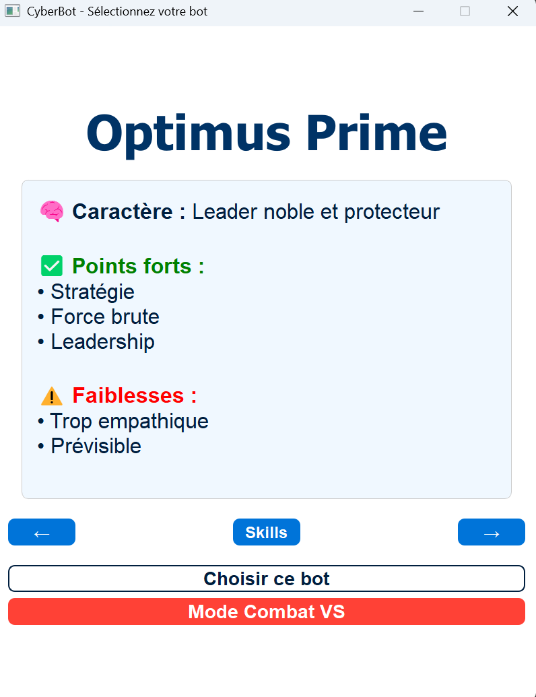
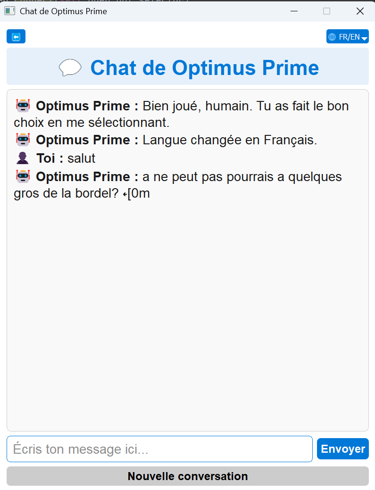
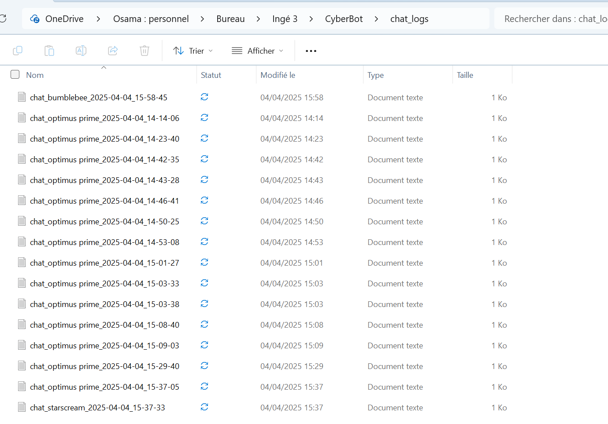
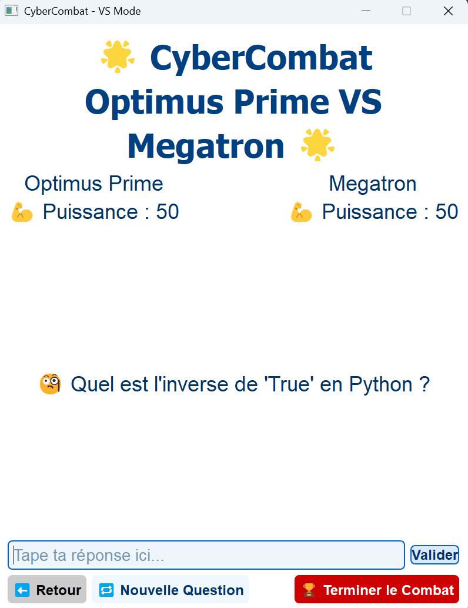

# 🤖 CyberBot - Projet Python IA Transformers

**CyberBot** est un projet interactif alliant **chatbot intelligent** et **mini-jeu éducatif** dans l’univers des Transformers. Le joueur peut discuter avec un bot de son choix et participer à un combat de connaissances. L’application utilise une interface en **PyQt5** et un moteur de réponse **IA via Transformers**.

---

## ⚙️ Fonctionnalités principales

### 🏠 1. Écran d’accueil
Dès le lancement de l'application, l’utilisateur est accueilli par une animation stylisée et un fond Transformers spectaculaire.




---

### 🤖 2. Sélection du bot
Le joueur peut faire défiler 4 bots emblématiques : **Optimus Prime**, **Megatron**, **Bumblebee**, **Starscream**. Chaque bot possède des caractéristiques uniques (forces, faiblesses, caractère…).



---

### 🎯 3. Vue des compétences
Le bouton *Skills* permet d'afficher une fiche détaillée du bot sélectionné avec ses points forts et faibles, rendant le choix stratégique.




---

### 💬 4. Mode Chat avec IA
Une fenêtre de discussion permet de parler librement avec le bot. L’utilisateur peut choisir la langue (**Français / Anglais**), et les réponses sont générées via **Transformers**.




---

### 📂 5. Historique des discussions
Toutes les conversations sont enregistrées dans un dossier `chat_logs`, accessibles via un bouton. Idéal pour consulter ses anciennes discussions.




---

### ⚔️ 6. Mode Combat VS
Un mini-jeu sous forme de **quiz interactif**. Le joueur affronte un autre bot et répond à des questions de culture générale (Python, math, culture tech…). Chaque bonne réponse augmente la puissance du joueur.



---

## 🔧 Installation

```bash
git clone https://github.com/osama782rh/cyberbot.git
cd cyberbot
pip install -r requirements.txt
python main.py
```

---

## 🧠 Technologies utilisées

- Python 3
- PyQt5 (interface graphique)
- Transformers (moteur de réponse IA)
- Subprocess + Fichier `response.txt`
- Images & animations customisées